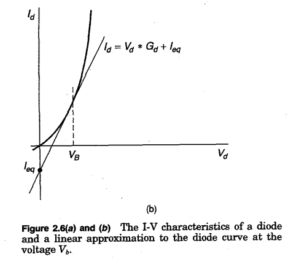
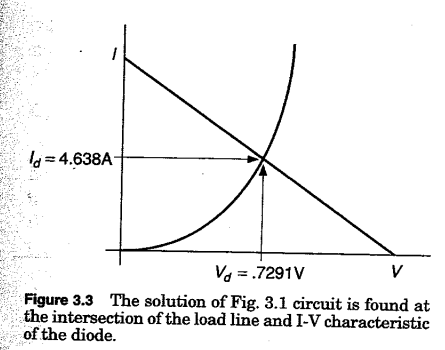

# This is a quick summary of the important parts (to us) from "Inside Spice" by Ron M. Kielkowski
<https://idoc.pub/download/kielkowski-inside-spice-d2nv6ogoxy4k>

## Chapter 2 - Nonlinear Elements
- break into many smaller linear approximations (similar to numerical integration methods for capacitors/inductors)
- linear equivalent model determined by voltage bias of device (conductance of model is equal to slope of straight line approximation at operating point) => We need to change the conductance matrix A during iterations when dealing with nonlinear components (at each solution point, the conductance and current values of the model are computed and stored in the system equations)  
**Linear diode model (p. 22):**  

## Chapter 2 - Nonlinear analysis
- SPICE uses two different solving algorithms (one if only linear components are present and one if both linear and nonlinear components are present)
- Newton-Raphson is used if and only if there are nonlinear components (equations become transcendental)
- Newton-Raphson approach starts with an initial guess for *every node voltage* in the circuit
- Previous solution voltages as initial guess for next series of iterations
- For a Newton-Raphson example applied to a trivial diode circuit, see page 35

## Chapter 3 - Convergence and the Newton-Raphson algorithm
- Newton-Raphson starts with guess and tries to get closer to load line intersection with every successive iteration (see HELM maths link for detailed information)

## Chapter 3 - General Newton-Raphson Convergence Aids
- Includes: RELTOL (default = 0.1%), VNTOL, ABSTOL, setting GMIN (also explained in Mitcheson's lecture slides)
- See page 52 for detailed explanation about what they do and why we need them 

# continue reading p. 54